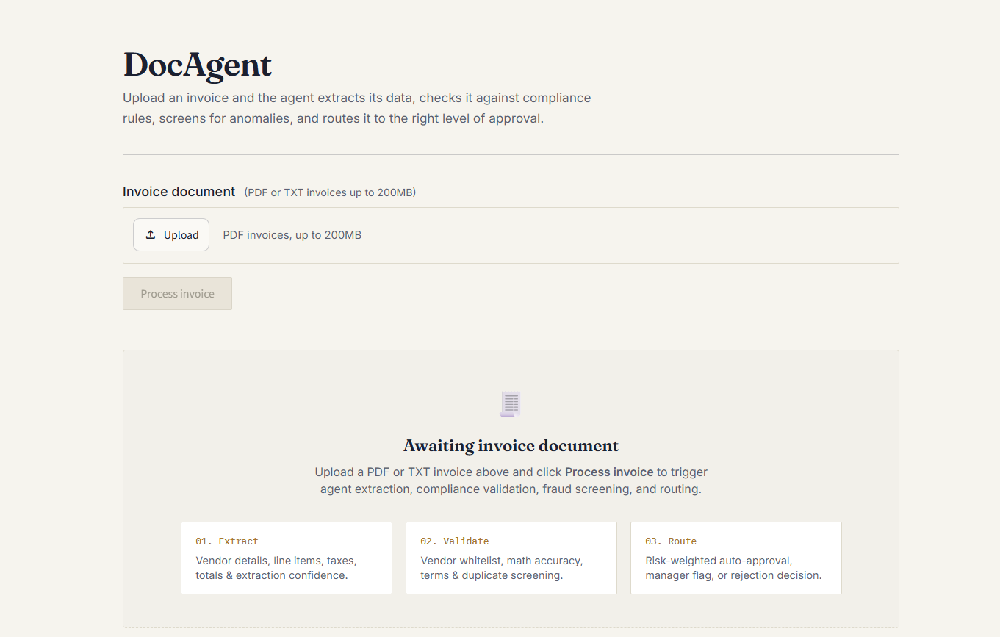
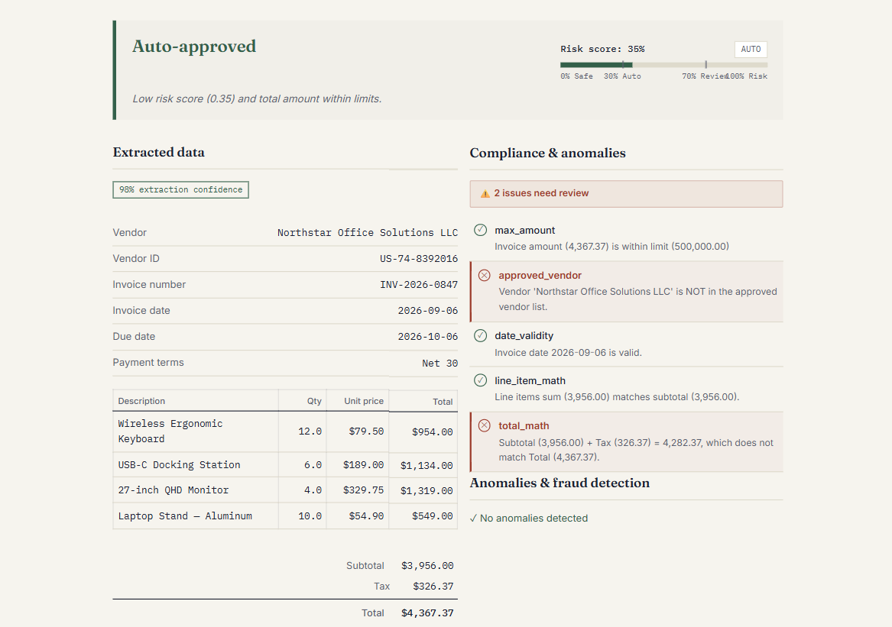
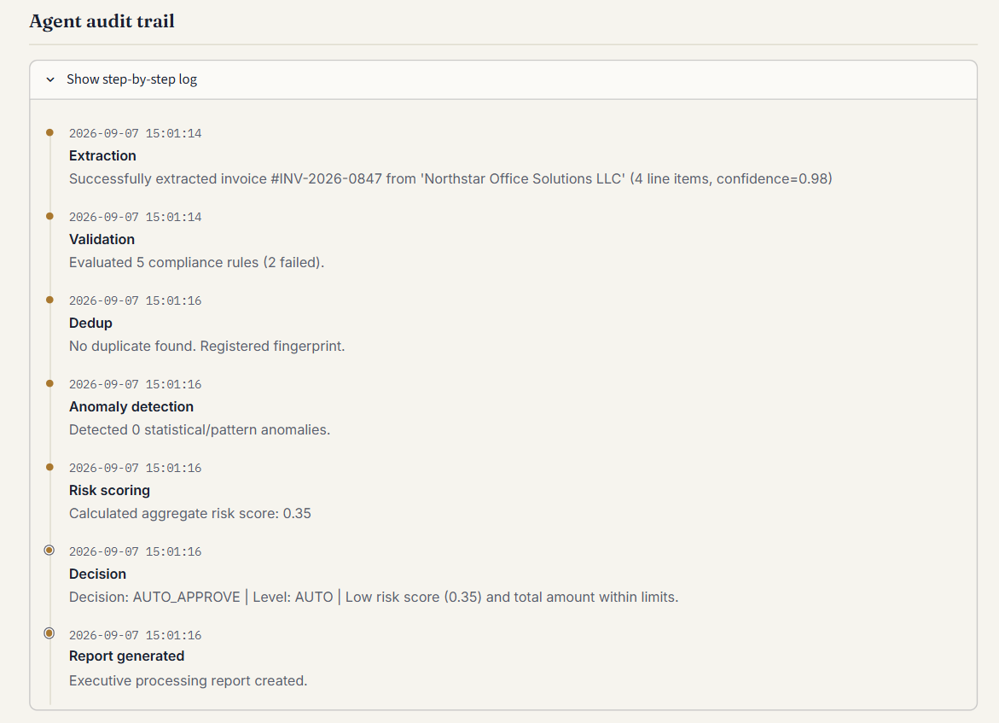

# DocAgent — Agentic Invoice Processing Engine

[](https://www.python.org/downloads/)
[](https://fastapi.tiangolo.com)
[](https://github.com/langchain-ai/langgraph)
[](https://streamlit.io)
[](https://www.docker.com/)
[](https://opensource.org/licenses/MIT)

> **DocAgent** is an autonomous, agentic document processing engine designed to streamline invoice and expense operations. It extracts structured data from unstructured invoices (PDF/TXT), validates compliance rules against configurable thresholds, performs anomaly and fraud screening, checks for duplicates, and autonomously routes approval decisions with an immutable step-by-step audit trail.

---

## System Architecture

```
                         ┌────────────────────────────────┐
                         │        Streamlit Dashboard     │
                         │   Upload · Status · Audit Trail│
                         └──────────────┬─────────────────┘
                                        │ REST API
                                        ▼
                         ┌────────────────────────────────┐
                         │        FastAPI Backend         │
                         │   /upload · /status · /history │
                         └──────────────┬─────────────────┘
                                        │
                                        ▼
                    ┌───────────────────────────────────────────┐
                    │        Agent Orchestrator (LangGraph)     │
                    │                                           │
                    │   State Machine:                          │
                    │   UPLOADED → EXTRACTING → VALIDATING      │
                    │   → ANOMALY_CHECK → ROUTING → DECIDED     │
                    │                                           │
                    │   ┌─────────── Tools ──────────────┐      │
                    │   │ • extract_invoice_data         │      │
                    │   │ • validate_compliance          │      │
                    │   │ • detect_anomalies             │      │
                    │   │ • check_duplicate              │      │
                    │   │ • route_approval               │      │
                    │   │ • generate_report              │      │
                    │   └────────────────────────────────┘      │
                    └────────┬──────────┬──────────┬────────────┘
                             │          │          │
                    ┌────────▼──┐  ┌────▼────┐  ┌──▼──────────┐
                    │ PostgreSQL│  │  Redis  │  │  Gemini API │
                    │ Invoices  │  │ Cache   │  │  Extraction │
                    │ Audit Log │  │ Dedup   │  │  Reasoning  │
                    │ Rules     │  │ Finger- │  │ (or GitHub  │
                    │           │  │ prints  │  │   Models)   │
                    └───────────┘  └─────────┘  └─────────────┘
```

---

## Key Features & Agent Workflow

1. **Multi-Modal Document Extraction:**
   - Powered by Gemini 2.5 Flash / GitHub Models (GPT-4o-mini).
   - Extracts vendor metadata, invoice numbers, dates, line items, taxes, totals, and confidence metrics.
2. **Deterministic Business Rule Validation:**
   - Verifies approved vendors, line-item arithmetic consistency, tax calculations, max spend caps, and date validity.
3. **Anomaly & Fraud Detection:**
   - Flags suspicious patterns such as round number billing, off-hours submissions, and statistical outliers against historical vendor baselines.
4. **Redis Duplicate Screening:**
   - Uses SHA-256 fingerprint hashing over key invoice attributes (`vendor_name:invoice_number:total_amount`) to instantly catch duplicate submissions.
5. **Dynamic Risk-Weighted Routing:**
   - Computes an aggregate risk score (0.00 – 1.00) and routes invoices to `AUTO_APPROVE`, `MANAGER_REVIEW`, `DIRECTOR_REVIEW`, or `REJECT`.
6. **Regulated-Ready Audit Trail:**
   - Every state transition, confidence score, and decision rationale is recorded into an append-only audit trail.

---

## User Interface & Screenshots

### 1. Document Upload & Processing Dashboard
Upload PDF or TXT invoices to initiate multi-stage extraction, compliance verification, and routing.


### 2. Extracted Data, Risk Scoring & Anomaly Inspection
Live feedback with extracted table breakdown, risk gauge, and compliance rule results.


### 3. Step-by-Step Agent Audit Trail
Transparent observability into every step executed by the LangGraph state machine.


---

## Technical Decisions & Rationale

| Decision Area | Technology / Pattern | Engineering Rationale |
|---|---|---|
| **Agent Framework** | LangGraph (State Machine) | Enables deterministic state transitions, checkpointing/resume capabilities, conditional routing, and granular step observability. |
| **LLM Provider** | Google Gemini 2.5 Flash / GitHub Models | Fast latency, high context window, cost-effective structured JSON schema enforcement, with fallback support. |
| **Duplicate Detection** | Redis Fingerprints | O(1) lookup for fast idempotency and duplicate checking with configurable TTL expiration. |
| **Compliance Engine** | DB-Driven Rules | Rules stored dynamically in PostgreSQL so compliance officers can modify thresholds without code redeployments. |
| **Audit Trail** | Append-only DB Logs | Provides an immutable event stream required for financial compliance and regulatory audits (SOC2 / SOX). |
| **Backend API** | FastAPI | Asynchronous I/O, automatic OpenAPI documentation, and strict Pydantic data validation schemas. |
| **Dashboard** | Streamlit | Rapid, reactive UI rendering with interactive audit logs and status metrics. |

---

## Getting Started

### Prerequisites
- Python 3.12+
- Docker & Docker Compose *(optional, for containerized execution)*
- Gemini API Key (or GitHub Personal Access Token for GitHub Models)

---

### Option A: Running with Docker (Recommended)

1. **Clone the repository:**
   ```bash
   git clone https://github.com/ayushcodes27/doc-agent.git
   cd doc-agent
   ```

2. **Configure environment variables:**
   ```bash
   cp .env.example .env
   # Edit .env and supply your GEMINI_API_KEY (or GITHUB_TOKEN)
   ```

3. **Launch the entire stack:**
   ```bash
   docker-compose up --build
   ```

4. **Access the services:**
   - **Streamlit UI:** [http://localhost:8501](http://localhost:8501)
   - **FastAPI Docs (Swagger):** [http://localhost:8000/docs](http://localhost:8000/docs)
   - **PostgreSQL:** `localhost:5432`
   - **Redis:** `localhost:6379`

---

### Option B: Running Locally (Without Docker)

1. **Create and activate a virtual environment:**
   ```bash
   python -m venv .venv
   # Windows (PowerShell):
   .venv\Scripts\Activate.ps1
   # macOS/Linux:
   source .venv/bin/activate
   ```

2. **Install dependencies:**
   ```bash
   pip install -r requirements.txt
   ```

3. **Configure environment:**
   ```bash
   cp .env.example .env
   # Ensure your GEMINI_API_KEY / GITHUB_TOKEN are set in .env
   ```

4. **Start the FastAPI backend server:**
   ```bash
   uvicorn api.main:app --host 127.0.0.1 --port 8000 --reload
   ```

5. **In a separate terminal, launch the Streamlit frontend:**
   ```bash
   streamlit run ui/app.py
   ```

---

## Running Tests

The test suite covers data models, agent nodes, validation rules, anomaly detection, deduplication, and the full LangGraph workflow.

```bash
# Run all unit and integration tests
pytest

# Run tests with detailed output
pytest -v

# Run specific test modules
pytest tests/test_validator.py
pytest tests/test_agent_graph.py
pytest tests/test_duplicate_checker.py
```

---

## Repository Structure

```
doc-agent/
├── agent/            # LangGraph workflow, state schema, and node execution logic
├── api/              # FastAPI application, route handlers, and Pydantic models
├── db/               # SQLAlchemy models, database connection, and seed scripts
├── images/           # Application screenshots for documentation
├── tests/            # Pytest test suite covering agent and tools
├── tools/            # Modular tools (extractor, validator, anomaly detector, dedup, router)
├── ui/               # Streamlit web interface
├── config.py         # Application configuration & environment settings
├── docker-compose.yml# Multi-container orchestration (API, UI, Postgres, Redis)
├── Dockerfile        # Container image definition
└── requirements.txt  # Python package dependencies
```

---

## License
Distributed under the MIT License. See `LICENSE` for more information.
