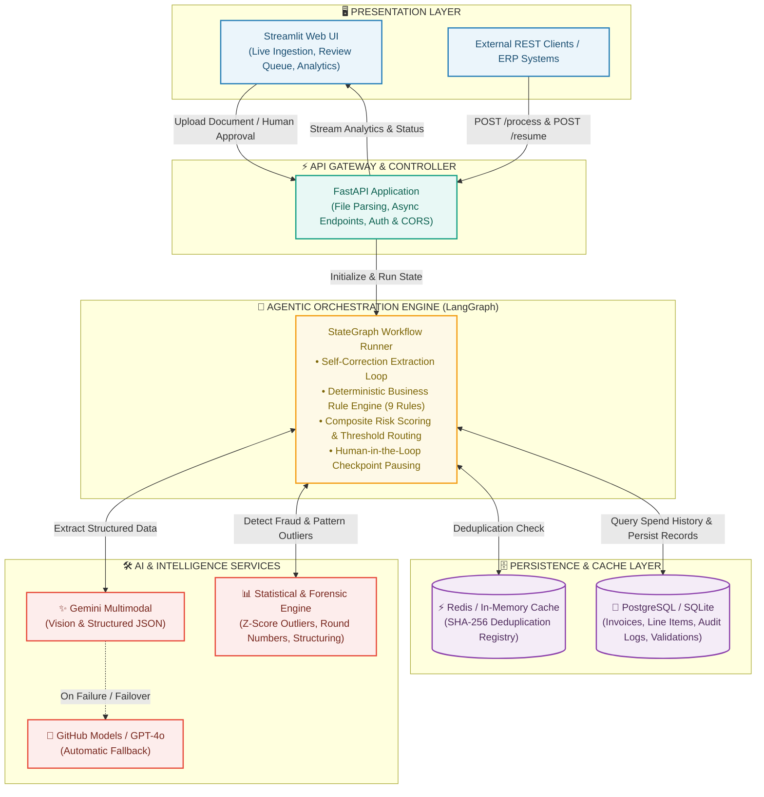

# DocAgent — Agentic Invoice Processing Engine

[](https://www.python.org/downloads/)
[](https://fastapi.tiangolo.com)
[](https://github.com/langchain-ai/langgraph)
[](https://www.sqlalchemy.org/)
[](https://streamlit.io)
[](https://www.docker.com/)
[](https://opensource.org/licenses/MIT)

> **DocAgent** is a production-grade, autonomous document processing agent designed to streamline accounts payable and enterprise invoice operations. It extracts structured data from multi-modal documents (PDF, Scanned Images, TXT), validates compliance against 9 deterministic business rules, performs statistical fraud & anomaly screening, detects SHA-256 duplicates, and manages human-in-the-loop approval workflows with full database persistence and an immutable audit trail.

---

## 🏛️ System Architecture

<div align="center">
  
</div>

<details>
<summary><b>🔍 View Interactive Mermaid Architecture Source</b></summary>


</details>

---

## ⚡ Core Capabilities & Agent Pipeline

```
Raw Invoice (PDF/Image/TXT)
  │
  ├─► 1. Multi-Modal Extraction Node (Gemini 2.5/3.6 Flash + GitHub Models fallback with auto-retry)
  │
  ├─► 2. Compliance Validation Node (9 Business Rules: Approved Vendors, Tax Math, Spends, Dates)
  │
  ├─► 3. SHA-256 Deduplication Node (Redis cache + In-memory fallback prevents duplicate payouts)
  │
  ├─► 4. Forensic Anomaly Detection Node (Z-Scores vs historical DB records, Round Numbers, Structuring)
  │
  ├─► 5. Risk Scoring & Decision Routing Node (Calibrated 0.0 - 1.0 composite risk score)
  │     ├── Risk < 0.25 & Amount ≤ 100k  ──► Auto-Approve
  │     ├── Risk ≥ 0.70 or Tampering     ──► Auto-Reject
  │     └── Risk ≥ 0.25 or Amount > 100k ──► Flag for Human Review (Manager / Director)
  │
  ├─► 6. Human-in-the-Loop Interrupt Node (Pauses graph execution; resumes on manager decision)
  │
  └─► 7. Database Persistence & Audit Trail (Full state saved to PostgreSQL/SQLite via SQLAlchemy 2.0)
```

---

## 🛡️ Business Validation Engine (9 Compliance Rules)

| Rule Name | Severity | Description |
|---|---|---|
| `max_amount` | `ERROR` | Invoice amount must not exceed departmental budget limit (₹500,000 / $500,000). |
| `approved_vendor` | `ERROR` | Vendor must be in the approved master vendor registry (24+ verified enterprise vendors). |
| `date_validity` | `ERROR` | Invoice date must be a valid ISO format and not post-dated in the future. |
| `visual_text_consistency` | `ERROR` | Embedded visual scan amount must match digital line items (tampering alert). |
| `line_item_math` | `WARNING` | Individual line items (`qty × rate`) must sum to subtotal within ±1% tolerance. |
| `total_math` | `WARNING` | Declared `Subtotal + Tax Amount` must match `Total Amount` within ±1% tolerance. |
| `vendor_id_present` | `WARNING` | Vendor must supply a valid tax registration identifier (GSTIN, VAT ID, EIN). |
| `currency_consistency` | `WARNING` | Currency must be a recognized ISO 4217 standard currency code (INR, USD, EUR, GBP). |
| `payment_terms_check` | `INFO` | Invoice must explicitly declare payment terms (e.g., Net 30, Due on Receipt). |

---

## 📊 Evaluation & Benchmark Suite

DocAgent includes a dedicated benchmarking harness evaluated against a curated dataset of **20 realistic enterprise invoices** across 5 distinct test categories (Clean, Compliance Failures, Anomaly Triggers, Multi-Tier Routing, and Edge Cases):

```bash
# Run the evaluation benchmark suite
python eval/run_eval.py --mode offline
```

### Benchmark Summary Results

| Benchmark Metric | Result | Target | Status |
|---|---|---|---|
| **Rule Compliance Accuracy** | `100.0%` (180/180 checks) | `≥ 95.0%` | ✅ PASSED |
| **Anomaly Detection Precision** | `1.00` | `≥ 0.90` | ✅ PASSED |
| **Anomaly Detection Recall** | `1.00` | `≥ 0.90` | ✅ PASSED |
| **Anomaly Detection F1 Score** | `1.00` | `≥ 0.90` | ✅ PASSED |
| **Decision Routing Accuracy** | `100.0%` (20/20 invoices) | `≥ 95.0%` | ✅ PASSED |
| **Approval Level Routing** | `100.0%` (20/20 invoices) | `≥ 95.0%` | ✅ PASSED |

*Full evaluation reports are auto-generated to [`eval/eval_report.md`](eval/eval_report.md) and [`eval/eval_report.json`](eval/eval_report.json).*

---

## 📸 User Interface & Screenshots

### 1. Document Upload & Processing Dashboard
Upload PDF, Image, or TXT invoices to initiate multi-stage extraction, compliance verification, and routing.


### 2. Extracted Data, Risk Scoring & Anomaly Inspection
Live visual feedback with extracted table breakdown, composite risk gauge, and compliance rule results.


### 3. Step-by-Step Agent Audit Trail
Transparent observability into every step executed by the LangGraph state machine.


---

## 🛠️ Technical Decisions & Architecture Rationale

| Decision Area | Technology / Pattern | Engineering Rationale |
|---|---|---|
| **Agent Framework** | LangGraph (StateGraph) | Deterministic state machine, checkpointing/resume capabilities, conditional routing, and granular step observability. |
| **Multi-Modal LLMs** | Google Gemini + GitHub Models (GPT-4o) | High-speed multi-modal vision with automatic failover for high availability and zero vendor lock-in. |
| **Persistence Layer** | SQLAlchemy 2.0 ORM | Enterprise relational data layer with auto-fallback to SQLite when PostgreSQL is offline for zero-friction local development. |
| **Duplicate Prevention** | Redis + SHA-256 Fingerprinting | O(1) idempotent hash lookup over key invoice attributes (`vendor:number:total`) with configurable TTL. |
| **Human-in-the-Loop** | LangGraph Interrupts | Pauses workflow execution for manager/director sign-off without dropping state; resumes via `/resume/{thread_id}`. |
| **Backend API** | FastAPI | Async I/O, automatic OpenAPI Swagger documentation, dependency injection, and Pydantic validation. |
| **Frontend UI** | Streamlit | Rapid, reactive UI rendering with interactive audit logs, pending review queues, and live analytics. |

---

## 🚀 Getting Started

### Prerequisites
- Python 3.12+
- Gemini API Key (or GitHub Personal Access Token for GitHub Models)
- Docker & Docker Compose *(optional, for containerized execution)*

---

### Option A: Running with Docker (Recommended)

1. **Clone the repository:**
   ```bash
   git clone https://github.com/ayushcodes27/doc-agent.git
   cd doc-agent
   ```

2. **Configure environment variables:**
   ```bash
   cp .env.example .env
   # Edit .env and supply your GEMINI_API_KEY (or GITHUB_TOKEN)
   ```

3. **Launch the entire stack:**
   ```bash
   docker-compose up --build
   ```

4. **Access the services:**
   - **Streamlit UI:** [http://localhost:8501](http://localhost:8501)
   - **FastAPI Docs (Swagger):** [http://localhost:8000/docs](http://localhost:8000/docs)
   - **PostgreSQL:** `localhost:5432`
   - **Redis:** `localhost:6379`

---

### Option B: Running Locally (Without Docker)

1. **Create and activate a virtual environment:**
   ```bash
   python -m venv .venv
   # Windows (PowerShell):
   .venv\Scripts\Activate.ps1
   # macOS/Linux:
   source .venv/bin/activate
   ```

2. **Install dependencies:**
   ```bash
   pip install -r requirements.txt
   ```

3. **Configure environment:**
   ```bash
   cp .env.example .env
   # Ensure your GEMINI_API_KEY / GITHUB_TOKEN are set in .env
   ```

4. **Start the FastAPI backend server:**
   ```bash
   uvicorn api.main:app --host 127.0.0.1 --port 8000 --reload
   ```

5. **In a separate terminal, launch the Streamlit frontend:**
   ```bash
   streamlit run ui/app.py
   ```

---

## 🧪 Running Unit & Integration Tests

The test suite covers data models, agent nodes, validation rules, anomaly detection, deduplication, database persistence, and the complete LangGraph workflow.

```bash
# Run all 42 unit and integration tests
pytest -v

# Run evaluation benchmark suite
python eval/run_eval.py --mode offline
```

---

## 📁 Repository Structure

```
doc-agent/
├── agent/       # LangGraph StateGraph workflow, nodes, & human-in-the-loop logic
├── api/         # FastAPI REST service (/process, /resume, /invoices, /analytics)
├── db/          # SQLAlchemy 2.0 persistence layer, ORM models, & repository CRUD
├── eval/        # 20-invoice benchmark dataset & evaluation runner (run_eval.py)
├── tools/       # Multi-modal extractors, 9-rule validator, anomaly & dedup engines
├── ui/          # Streamlit frontend (Document ingestion, review queue, analytics)
├── tests/       # Pytest unit & integration test suite (42 tests)
├── config.py    # Environment configuration & LLM provider settings
└── docker-compose.yml # Container orchestration (API, UI, PostgreSQL, Redis)
```

---

## 📄 License
Distributed under the MIT License. See `LICENSE` for more information.
